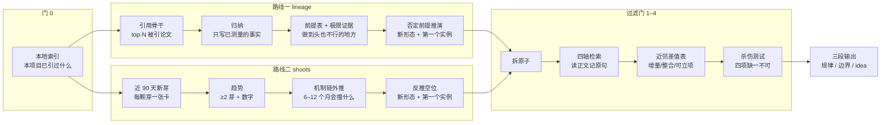

<div align="center">

# 🔭 idea-forecast

**先看清规律，再预测 idea，最后证明它还没人做。**

一个给 Claude Code 用的选题 skill：从一条研究脉络里找出下一个最值得投入的 idea，并用检索和杀伤测试把它过滤到"可立项"。

[](#-60-秒上手)
[](#-60-秒上手)
[](LICENSE)
[](#-路线图)

</div>

---

## 🎯 它解决的问题

选题最常见的两种死法：

| 死法 | 现象 | 根因 |
|---|---|---|
| **先想后查** | 想好 idea 再去"确认"没人做过，投稿前发现 2012 年就有人做了 | 检索词沿用自己的框架，读摘要不读正文 |
| **补格子** | 在热点里挑一个没人填的格子，做完只是别人工作的增量 | 没有问过"这条路的前提是什么、做到头会怎样" |

`idea-forecast` 把顺序反过来，并设三道硬门：

> **没有地形图不许预测；没有原子级近邻表不许说"空位"；没有杀伤测试不许开实验。**

生成 idea 不靠头脑风暴，靠两条可复现的路线：**从脉络的共享前提往外推**，或者**从最近三个月的新芽往前推**。两条路线的候选都要过同一套过滤门。产出固定为三段，对应导师最常问的三件事：**发现的规律 / 已做的边界 / 未来可做的 idea**。

---

## 🗺️ 全流程一图



---

## 🧭 四种用法

| 命令 | 做什么 | 什么时候用 |
|---|---|---|
| `/idea-forecast forecast <方向> --mode lineage` | 骨干论文 → 规律 → 前提 → 极限证据 → 推演新形态；推演落盘后才看近 90 天论文查空位 | 想开新流派、不想被最新论文的框架带着走 |
| `/idea-forecast forecast <方向> --mode shoots` | 近 90 天新芽 → 趋势 → 外推预测 → 反推空位 | 押最近的动向 |
| `/idea-forecast forecast <方向> --mode compare` | 两条都跑、同一套门、出对比表 | 回答"哪种方式找到的 idea 更好"，每次留档攒规律 |
| `/idea-forecast check <idea>` | 已有 idea 直接过门 0–4 | "这个有人做过吗" |

---

## ⚡ 60 秒上手

```bash
# 1. 装
git clone https://github.com/SanN2Z/idea-forecast ~/.claude/skills/idea-forecast

# 2. 在你的项目里建一个 idea-stage 目录，写一份配置（模板见 templates.md §0）
mkdir -p idea-stage/terrain && cp ~/.claude/skills/idea-forecast/templates.md idea-stage/terrain/  # 抄 §0 到 CONFIG.md

# 3. 在 Claude Code 里
/idea-forecast forecast 智能体自进化 --mode compare
```

跑完在 `idea-stage/terrain/` 里拿到：`FORECAST_lineage_<date>.md`、`FORECAST_shoots_<date>.md`、`COMPARE_<date>.md`，以及所有论文卡与检索日志。

脚本也可以单独用：

```bash
# 本地索引：本项目已经引过哪些论文（门 0）
python scripts/terrain_index.py --project idea-stage --build
python scripts/terrain_index.py --project idea-stage --query "marginal contribution"

# 骨干 + 近期：按引用数拉前 40 篇、按提交日期拉近 90 天
python scripts/cited_backbone.py --project idea-stage \
  --query '"self-evolving" agent' --query '"self-improving" "language model"' \
  --top 40 --since 2019 --recent-days 90

# 把一份检索 brief 交给外部模型（Codex / Gemini / 任何 CLI）
python scripts/search_b.py --brief idea-stage/terrain/briefs/A1.md --name A1 --project idea-stage
```

---

## 🧑‍⚖️ 角色分工（写死，载体可换）

| 角色 | 默认载体 | 只做 | 不做 |
|---|---|---|---|
| **裁判** | 主会话，用手上最强的推理模型 | 拆原子、写检索 brief、差值分类、杀伤测试、列前提、否定推演、押注；每个判断前**亲自读卡片里的原句** | 不自己跑大规模检索；门 0–3 完成前不写任何预测 |
| **搜索者 A** | 子代理（Opus 级），一次一个 | 读骨干与近期列表、读正文、写卡片、归纳事实 | 不外推、不判新颖、不写押注 |
| **搜索者 B** | 任意外部 CLI，或无 | 相邻领域、经典文献、产品侧、交叉检索 | 结果只作线索，进卡片前须读正文 |
| **脚本** | 三个 Python 文件 | 本地索引、拉骨干与近期、调外部 CLI | — |

推理与预测全部由裁判做，搜索者只出卡片和表。组里换模型也能跑。

---

## 📦 产出长什么样

```
idea-stage/terrain/
├── CONFIG.md                 方向、模式、模型、预算
├── INDEX.md / index.json     本项目已引论文索引
├── backbone_<slug>_<date>.md 引用骨干列表（脚本生成）
├── recent_<slug>_<date>.md   近 90 天列表（脚本生成）
├── cards/<id>.md             论文卡：原子主张、测量对象、英文原句、读取深度
├── CLAIMS.md                 原子账本 + 检索日志（查过的不重查）
├── AXIOMS.md                 前提表 + 极限证据表 + 否定推演表
├── briefs/ searches/         给搜索者 B 的 brief 与它的回执
├── FORECAST_lineage_<date>.md
├── FORECAST_shoots_<date>.md 三段输出：规律 / 边界 / idea
├── COMPARE_<date>.md         两条路线的对比表
└── POSTMORTEM.md             被抢复盘：哪道门本该拦住、缺了哪个检索词
```

三段输出的模板、近邻矩阵、杀伤测试清单、COMPARE 表都在 [`templates.md`](templates.md)。

---

## 🔒 硬规则（skill 会拒绝跳过）

- 门 0–3 完成前不出现"预测""押注"字样；lineage 推演落盘前不看近期论文，shoots 预测落盘前不看骨干推演。
- 卡片必须有英文原句与读取深度；只读摘要的标 `[abstract-only]`，不能支撑"未见先例"，不能进机制链；综述不作证据。
- 只被一方搜索者命中的近邻标 `[single-source]`，补读正文才算数；两方都没命中才能写"在检索范围内未见"。
- "没人做过"只能写成"在以上检索范围内未见"，近邻表原样附在汇报里。
- 每次被抢都记进 `POSTMORTEM.md`，缺的检索词回填到词表。这是它自我改进的唯一入口。

---

## 📖 一个跑过的例子

[`examples/worked-example-rlhf-to-dpo.md`](examples/worked-example-rlhf-to-dpo.md)：把 as_of 设在 2023 年 3 月，用 lineage 路线"事后重演"RLHF 这条公开脉络，看流程能否在 DPO 出现之前推出它的形态。每一步的产物（骨干表、前提表、近邻差值表、杀伤测试、复盘条目）都有样子可抄。

---

## ❓ 常见问题

**Q：和 `/novelty-check` 有什么区别？**
查新只回答"有没有人做过"。本 skill 先回答"该做什么"，再把候选拆成原子逐个查新，并要求给出与最近三篇的精确差值和被抢概率。`/novelty-check` 可以作为门 2 的补充检索器。

**Q：没有 Codex 或第二个模型怎么办？**
配置里写 `searcher_B: none`。搜索者 A 必须把相邻领域和经典文献也查一遍，并把只被一方命中的近邻标 `[single-source]`。

**Q：为什么两条路线都要跑？**
它们的盲区不同：从骨干推容易忽略刚冒出来的新方向，从新芽推容易被最新论文的框架带着走。`compare` 模式把两条的主押注放到同一张表上打分，攒几次就能看出在你的领域哪条更准。

**Q：脚本用了哪些数据源？**
OpenAlex（引用数、标题+摘要匹配，默认剔除综述）和 arXiv API（按提交日期）。都免费无 key。Semantic Scholar 无 key 会被限流，没用。

**Q：能接现有的研究流水线吗？**
能。门 4 之后可以调 `/research-review` 做跨模型评审，预注册之后可以调 `/research-refine-pipeline` 出实验计划。本 skill 只负责"规律 → 预测 → 过滤"这一段。

---

## 🛤️ 路线图

- [x] lineage / shoots / compare / check 四种用法
- [x] 骨干与近期采集脚本、外部搜索者接口、本地索引
- [ ] compare 结果的跨次汇总（攒够 5 次自动出"哪条路线在本领域更准"）
- [ ] 卡片去重与跨项目共享的地形库
- [ ] 英文版 SKILL.md

---

## 📄 许可

MIT。欢迎提 issue 记录你的"被抢"案例，那是这套流程改进的原料。
